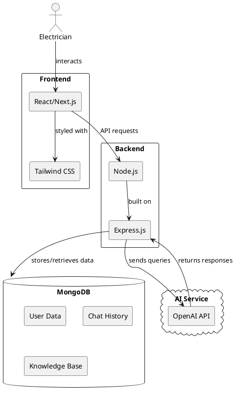

```plantuml
@startuml
!define RECTANGLE class

skinparam componentStyle rectangle

rectangle "Frontend" {
    [React/Next.js]
    [Tailwind CSS]
}

rectangle "Backend" {
    [Node.js]
    [Express.js]
}

database "MongoDB" {
    [User Data]
    [Chat History]
    [Knowledge Base]
}

cloud "AI Service" {
    [OpenAI API]
}

actor "Electrician" as user

user --> [React/Next.js] : interacts
[React/Next.js] --> [Tailwind CSS] : styled with
[React/Next.js] --> [Node.js] : API requests
[Node.js] --> [Express.js] : built on
[Express.js] --> [MongoDB] : stores/retrieves data
[Express.js] --> [OpenAI API] : sends queries
[OpenAI API] --> [Express.js] : returns responses

@enduml
```
